<h1>Active Directory Security Audit: Privileged Access Review</h1>

<h2>Description</h2>

This project demonstrates a security-focused audit of privileged access within an Active Directory environment. The lab simulates real-world administrative and security tasks used to identify, review, and remediate high-risk account permissions.

In this lab, I used PowerShell and Active Directory tools to audit Domain Admins and other high-privilege groups, remove unauthorized access, and generate CSV reports for compliance and security monitoring. This project highlights practical experience in access control, privilege management, and security auditing within a Windows Server environment.

 

<h2>Languages and Utilities Used</h2>

- <b>PowerShell</b>
- <b>Active Directory Users and Computers (ADUC)</b>
- <b>Active Directory Domain Services (AD DS)</b>
- <b>CSV Reporting</b>

 

<h2>Environments Used</h2>

- <b>Windows Server 2019</b>
- <b>Windows 10</b>

 

<h2>Security Audit Walk-through:</h2>

Open Active Directory Users and Computers 
<i>Access the domain environment to manage and review user accounts.</i> 

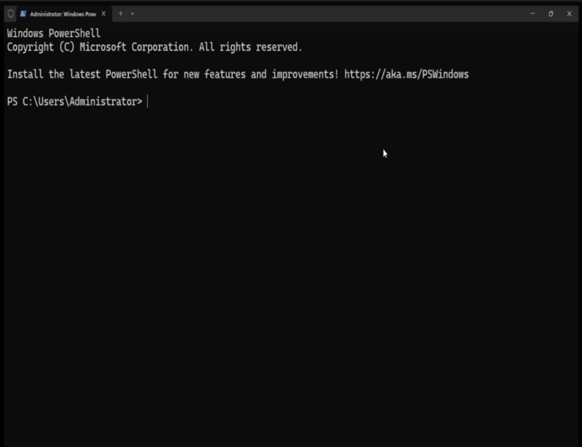
  

Identify Domain Admins Using PowerShell 
<i>Retrieve members of the Domain Admins group to identify privileged users.</i> 

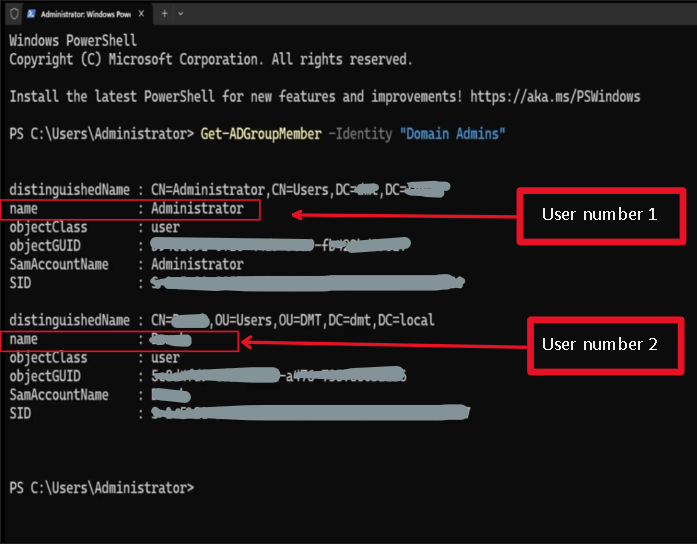
  

Export Domain Admins to CSV Report 
<i>Generate a report of privileged users for auditing and compliance purposes.</i> 

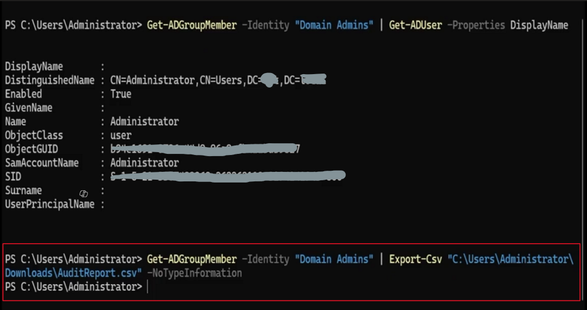
  

Verify CSV Report Output 
<i>Confirm the report was successfully generated and stored.</i> 

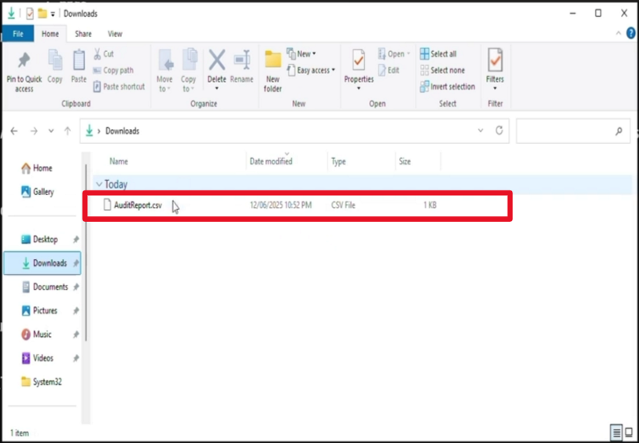
  

Remove User from Domain Admins Group 
<i>Revoke unnecessary administrative privileges to enforce least privilege.</i> 

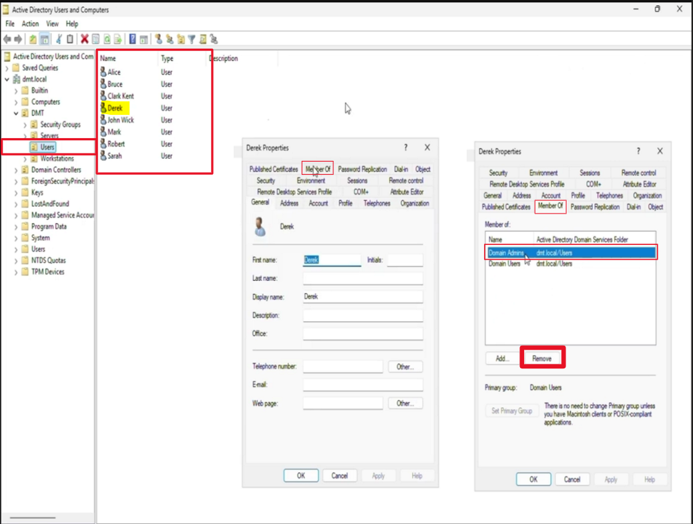
 
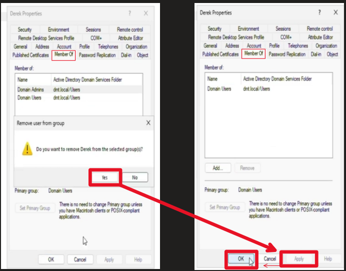
  

Create PowerShell Script to Audit High-Privilege Groups 
<i>Develop a script to audit multiple high-risk Active Directory groups.</i> 

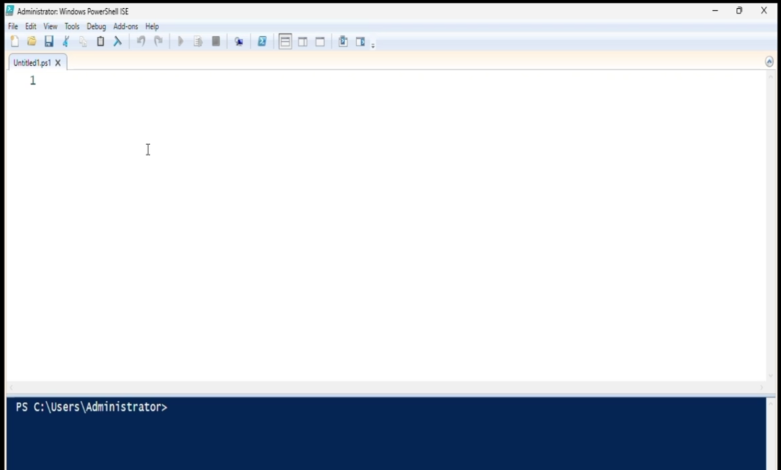
 
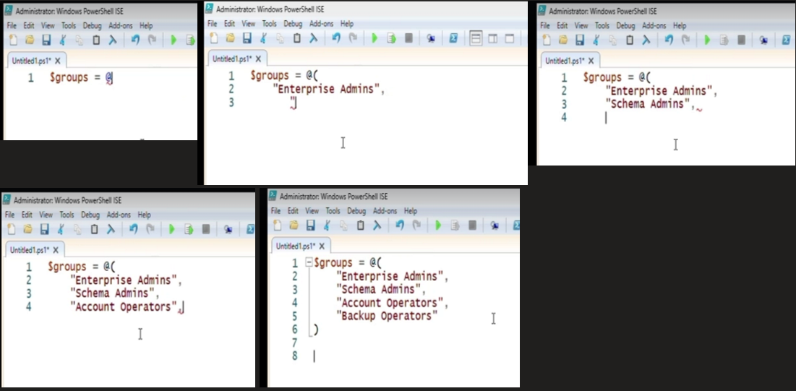
 
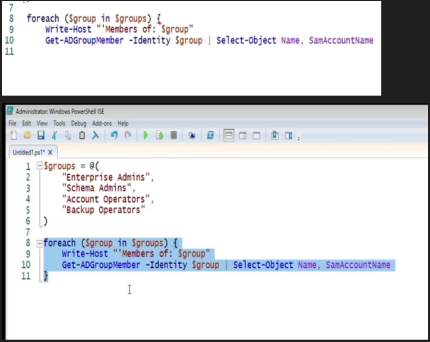
  

Execute Script and Review Output 
<i>Run the audit script to identify members of high-privilege groups.</i> 

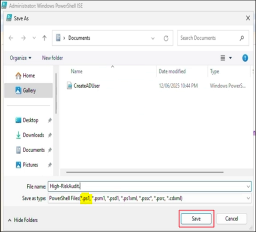
 
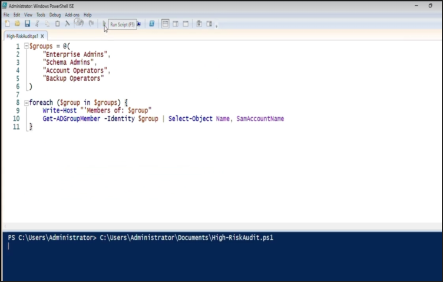
 
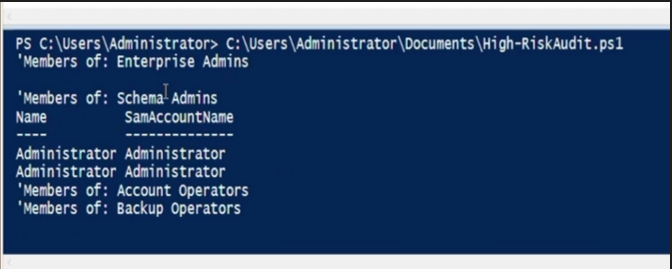

  

<h2>Skills Demonstrated</h2>

• Privileged Access Auditing  
• Active Directory Security Management  
• PowerShell Scripting and Automation  
• Identity and Access Management (IAM)  
• Security Compliance Reporting  
• Least Privilege Enforcement  
